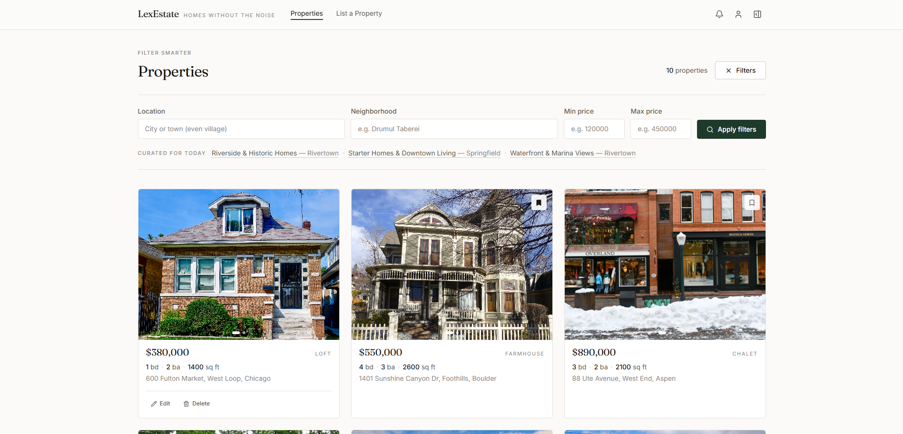
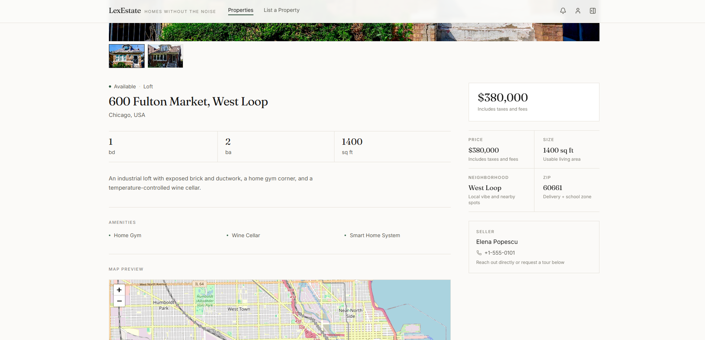
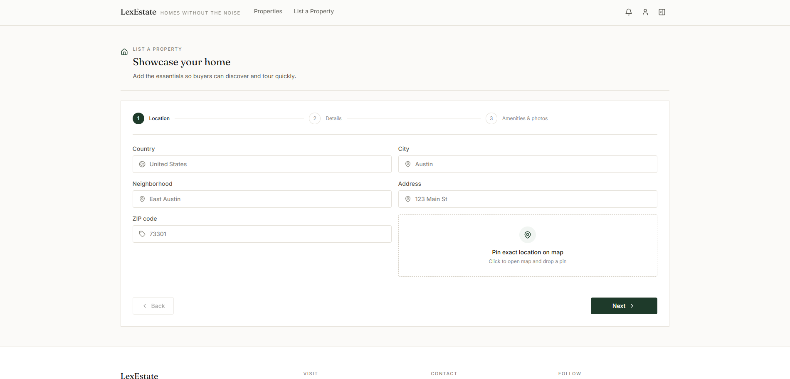
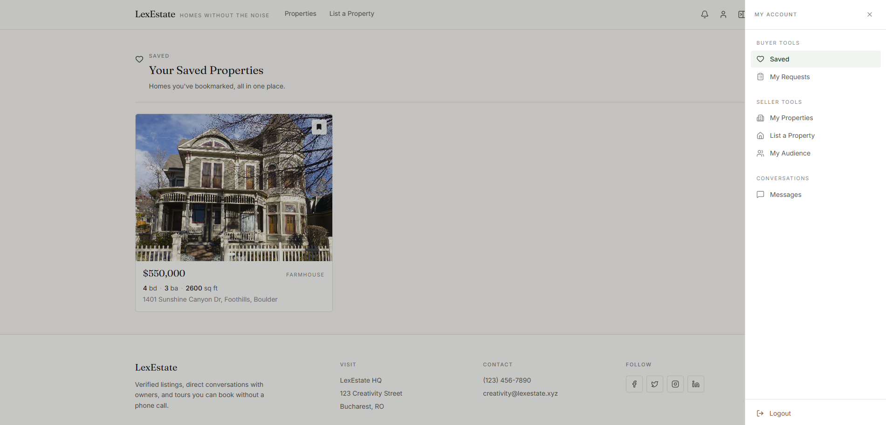

## LexEstateCo

LexEstateCo is a full-stack real estate marketplace. Agents and owners list
properties, buyers browse and filter listings, and both sides can message
each other and book tours directly in the app. It is built with a React and
Vite frontend and an Express and Sequelize backend running on Postgres.

### Screenshots


<table>
  <tr>
    <td></td>
    <td></td>
  </tr>
  <tr>
    <td></td>
    <td></td>
  </tr>
</table>

### Features

- Email and password authentication using JWT, issued on login and register
  and verified on every write request
- Property listings: create, edit, and delete for the owner only, with
  public browsing for everyone and image uploads per listing
- Saved properties (favorites) per user
- Tour requests: buyers ask to view a property, agents accept or reject,
  buyers can cancel or remove a request afterward
- In-app messaging per property between buyer and agent
- Notifications for the events above (new request, request updated, and so on)
- A small `/stats` endpoint returning user and property counts plus an
  average feedback rating (kept in memory, so it resets on server restart;
  this is not meant to be a real analytics pipeline)
- Shared color tokens in the Tailwind config so the theme can be adjusted
  from one file instead of editing individual components

### Tech stack

- **Client**: React 18, TypeScript, Vite, Redux Toolkit, React Router, Tailwind CSS
- **Server**: Node/Express, Sequelize, Postgres, JWT, bcrypt, multer for uploads
- **Testing**: Jest (server, unit tests plus an integration suite that spins
  up a real throwaway Postgres container), Vitest and React Testing Library (client)
- **CI**: GitHub Actions runs both test suites plus a production build on
  every push and pull request

### Project structure

Both the client and the server are organized by feature rather than by file
type. Each feature or module owns every layer it needs; only the pieces
that are genuinely shared sit outside them.

```
client/src/
  features/
    auth/           login, register
    hero/           homepage sections
    properties/     listings, property detail, saved and owned properties
      components/
        pages/      route-level components (PropertiesPage, ViewPropertyPage)
        tabs/       account-area tabs
        modals/     edit, delete, and status modals
        card/       the property card and its tests
      hooks/
    tour-requests/  booking a tour, the requester and agent views
    messaging/      conversations between buyer and agent
  components/       shared UI only: common (empty/loading states, the map),
                    layout (navbar, side panel, footer), modals (feedback)
  hooks/            generic, cross-feature hooks
  pages/            route-level pages that do not belong to one feature
                    (account settings, the manage dashboard)
  schemas/          Zod schemas, grouped the same way as the features
  state/            Redux slices: user and tab stand alone, everything else
                    (feedback, language, side panel, client metadata)
                    lives under state/ui

server/
  modules/
    users/           auth, user profile, feedback rating
    properties/      listings, saved properties, curated picks
    tourRequests/    booking a tour
    messaging/       conversations
    notifications/
    stats/           the /stats endpoint
  config/            database connection
  middlewares/       requireAuth, assertSelf, catchAsync, errorHandler
  models/index.js    wires up the associations between every module's models
  test/              integration test harness (spins up its own Postgres container)
```

Each module under `modules/` has its own `controllers/`, `models/`,
`routes/`, and, where they exist, `__tests__/`. The client mirrors this with
`components/` and `hooks/` per feature.

### Getting started

You need Node 18 or newer and either a local Postgres instance or the
Docker setup described below.

**server/.env**

```
PORT=5000
DB_HOST=localhost
DB_PORT=5432
DB_USER=<your-db-username>
DB_PASSWORD=<your-db-password>
DB_NAME=<your-db-name>
JWT_SECRET=<anything-long-and-random>
```

**client/.env**

```
VITE_API_HOST=http://localhost
VITE_API_PORT=5000
```

Then, from the repository root:

```bash
npm install --prefix server
npm install --prefix client
npm run dev
```

`npm run dev` runs both the API and the client concurrently. The API listens
on `PORT` (5000 by default) and the Vite dev server runs on 5173 with hot
reload for client-side changes, including Tailwind. If you are iterating on
the client, run it locally rather than through Docker (see the Docker
Compose section below).

### Testing

```bash
npm test --prefix server                    # unit tests, mocked Sequelize
npm run test:integration --prefix server    # real Postgres in a throwaway Docker container, requires Docker
npm test --prefix client                    # Vitest and React Testing Library
```

The integration suite exists because a mock will happily accept a query
with the wrong column name and return whatever it was told to. That is
exactly how a bug slipped through earlier: a saved-property lookup querying
`userId`/`propertyId` against columns actually named `user_id`/`property_id`,
which silently always returned "not saved." Both layers are worth keeping.

### API surface

| Resource         | Routes                                                                                                                                                                                                                                            | Auth                                            |
| ---------------- | ------------------------------------------------------------------------------------------------------------------------------------------------------------------------------------------------------------------------------------------------- | ----------------------------------------------- |
| Auth             | `POST /auth/login`, `POST /auth/register`                                                                                                                                                                                                         | public                                          |
| Users            | `GET /users/`, `GET /users/:id`, `GET /users/email/search`, `PUT /users/change-password`, `PUT /users/:id/give-feedback`                                                                                                                          | change-password and give-feedback require auth  |
| Properties       | `GET /properties/`, `GET /properties/:id`, `GET /properties/agent-id/:agentId`, `GET /properties/location/:location`, `POST /properties/`, `PUT /properties/:propertyId`, `DELETE /properties/:propertyId`, `POST /properties/:propertyId/images` | reads public, writes require auth and ownership |
| Saved properties | `GET /saved-properties/:userId`, `POST /saved-properties/check`, `POST /saved-properties/`, `DELETE /saved-properties/`                                                                                                                           | auth required                                   |
| Tour requests    | `POST /tour-requests/`, `GET /tour-requests/requester/:requesterId`, `GET /tour-requests/agent/:agentId`, `GET /tour-requests/requester/:requesterId/property/:propertyId`, `PUT /tour-requests/:id/status`, `DELETE /tour-requests/:id`          | auth required                                   |
| Conversations    | `POST /conversations/start`, `GET /conversations/user/:userId`, `GET /conversations/property/:propertyId/user/:userId`, `GET /conversations/:conversationId/messages/:userId`, `POST /conversations/:conversationId/messages`                     | auth required                                   |
| Notifications    | `GET /notifications/:ownerId`, `DELETE /notifications/:ownerId`, `DELETE /notifications/:ownerId/:notificationId`                                                                                                                                 | auth required                                   |
| Curated          | `GET /curated/today`                                                                                                                                                                                                                              | public                                          |
| Stats            | `GET /stats/summary`                                                                                                                                                                                                                              | public                                          |

"Auth required" means a valid bearer token. Most of these routes also check
that the token's user owns the resource being touched, so you cannot edit
someone else's listing just because you are logged in.

### Data models

- **User**: first and last name, email, hashed password, phone, feedback rating
- **Property**: price, `location` (JSON object with country, city,
  neighborhood, address, and zip code, indexed on city), description, size,
  image references, agent (foreign key to User), status and type (enums),
  bedrooms, bathrooms, amenities (array of enum values)
- **SavedProperty**: user and property, a favorites join table
- **TourRequest**: property, agent, requester, requested time, status
  (enum: pending, accepted, rejected, canceled)
- **Conversation** / **Message**: one conversation per buyer and property,
  messages belong to a conversation
- **Notification**: owner, title, description, type (enum)

### Docker Compose

- `docker compose up --build` starts Postgres, the API, and the client
  (served as a static build via nginx)
- Client on `http://localhost:8080`, API on `http://localhost:5000`
- The client's API URL is baked in at build time (see `client/Dockerfile`),
  so changing `VITE_API_HOST`/`VITE_API_PORT` requires rebuilding that
  image rather than just restarting it
- This setup is meant for checking that the app works end to end, not for
  active development. For iterating on the UI, run
  `npm run dev --prefix client` locally against the dockerized API instead;
  you get instant hot reload rather than a rebuild on every change

### Known limitations

- No pagination on `GET /properties/`. This is fine for a demo dataset but
  would matter at real scale.
- The stats and feedback rating are stored in memory and reset whenever the
  server restarts.
- The client build produces one large bundle (about 650kb) with no code
  splitting yet.
- No refresh tokens. The JWT has a flat 7-day expiry, after which you are
  logged out and have to log back in.
